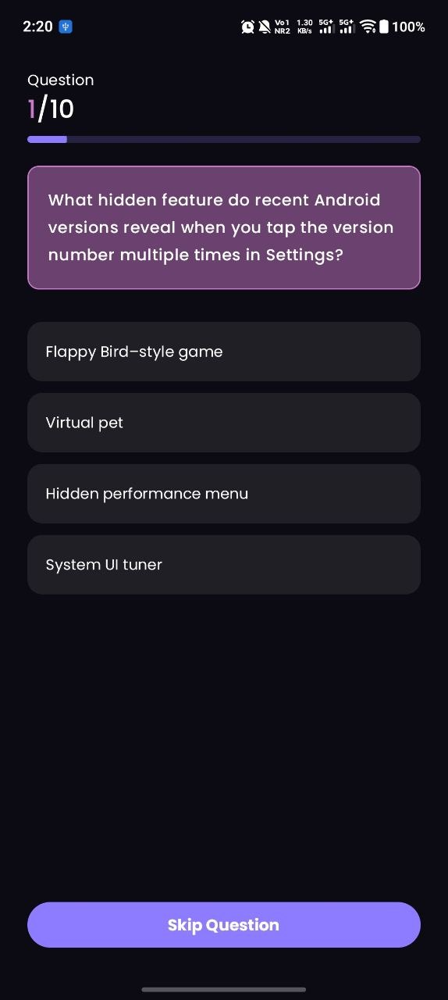
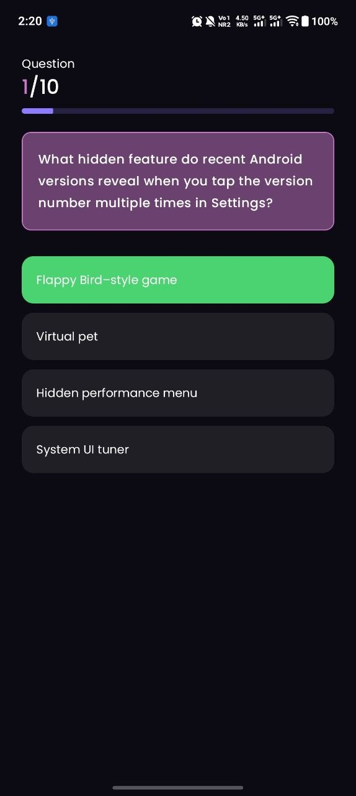
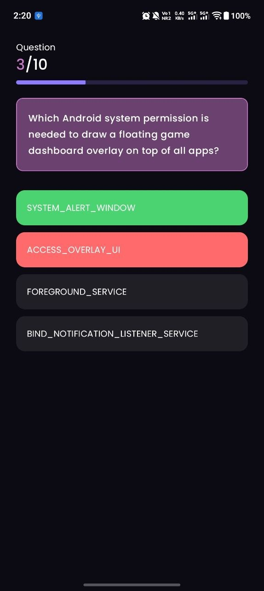
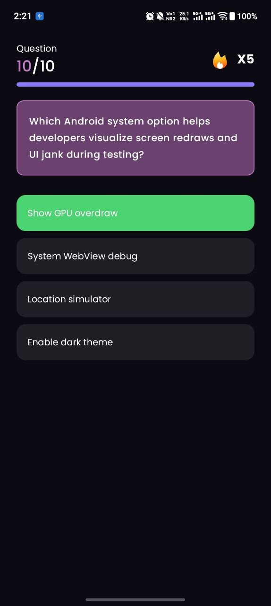
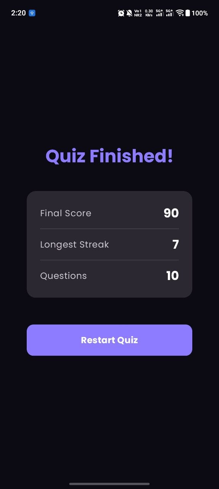

## Core Features

- [x] Parses questions from local JSON
- [x] Displays loading indicator while preparing data
- [x] Displays question and four options
- [x] Reveals selected answer and correct answer
- [x] Automatically moves to the next question after 2 seconds
- [x] Skip button for immediate navigation
- [x] Tracks consecutive correct answers
- [x] Streak activates after 3 consecutive correct answers
- [x] Wrong answer resets streak
- [x] Longest streak recorded
- [x] Correct / Total score
- [x] Longest streak
- [x] Restart quiz

## Additional Features
- Interactive Button Clicking animation
- User can check the skipped / previous questions with the answered option saved in state 
- Sound effects ( for tap and wrong answer)
- Haptic feedback ( for wrong and correct answer)
- Animated streak indicator ( lottie animation )

## Tech Stack

- Kotlin
- Jetpack Compose
- MVVM
- Coroutines
- StateFlow
- HorizontalPager
- Material 3
- Ktor

## Architecture 
```
app/
├── data/
│   ├── model/
│   │   └── Question.kt
│   ├── feedback/
│   │   ├── HapticManager.kt (Vibrator)
│   │   └── SoundManager.kt
│   └── repository ( QuizRepository.kt )
│
├── di/
│   └── Module.kt
│
├── ui/
│   ├── theme/
│   │   ├── Color.kt
│   │   ├── Theme.kt
│   │   └── Type.kt
│   │
│   └── quiz/
│       ├── QuizScreen.kt
│       ├── QuizState.kt
│       ├── QuizViewModel.kt
│       └── components/ (all the ui components )
│
├── MainActivity.kt
└── QuizApp.kt
```
### Demo

[Quick Google Drive Video Demo ( 1 min ) ](https://drive.google.com/file/d/11KqZhUmM6Ak4VhfJg5aXukmwPswP-DX0/view?usp=sharing)

### Screenshots

<p align="center">
  
  
  
  
  
</p>

### Inspiation 

Mixed up a [Dribble](https://dribbble.com/shots/24213853-Quiz-Mobile-App) and the design provided in the assignment

### Known Issue :( :( 

- Restarting the quiz briefly shows a reverse `HorizontalPager` transition before resetting.
- The results screen can be enhanced with richer animations.
- The loading experience can be improved with a dedicated splash/loading screen.


